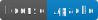
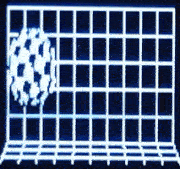
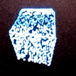

# ESP32 Demos

This project contains [ESP32](https://en.wikipedia.org/wiki/ESP32) demos written for the SSD1306 OLED display
including an I2C based simulator for the display device to simplify and speed up host based development.

Also included are tools to generate 2D and 3D graphics data.

<table><tr>
  <td style="padding: 20px; padding-right: 40px;"></td>
  <td style="padding: 20px; padding-right: 40px;"></td>
  <td style="padding: 20px;"></td>
</tr></table>

## Included Demos

### Hello

This is the classic "Hello, world!" example. Doesn't create display output, just uses the debug log.

### Hello Graphics

Graphical version of "Hello, world!". Shows some graphics library capabilities.

### Bitmap Demo

Shows advanced bitmap rendering with transparency and alpha keying.

### Scrolling Demo

Shows scrolling capabilities of the display including partial static areas.

### Oscilloscope Demo

Real-time oscilloscope for rendering live I/O data.

### Amiga Boing Ball

A tribute to the classic Amiga Boing Ball demo from CES 1984. Optimized frame
rates using memory page locking.

### Retro Demo

Some well known elements of retro demos, such as scrolling text, copper bars,
zooming bitmaps and a nice 3D starfield as found on home computers of the 80s.

### 3D Demo

Shows real-time shaded 3D graphics on monochrome display using stationary
dithering for triangle rasterization based on a simplified error diffusion
algorithm.

## Included Class Library

The following aspects are covered by the included class library:

* Application fundamentals
* Graphics fundamentals
* System abstraction (minimalistic)
* Simulation support (x86-based development)

## Included Tools

### Bitmap-To-Cpp

Converts PNG bitmaps to C++ array data. Supports alpha channel to generate
alpha masks for advanced blitting modes.

### Render Test

Generates PNG bitmaps using pygame to render to offscreen buffers, then store
the data to a file. Can be used as starting point for custom graphics.

### Blender Export

Exports vertices and indices of a selected Blender mesh object.

## Hardware Setup

This is the hardware setup used to develop the example:

* ESP32 board: Espressif ESP32 IOT ESP32-DEVKITC 32D ESP32-WROOM-32D
* Monochrome OLED display: AZDelivery AZOLED12864-1000, ean: 7091358562602
* Some cables: AZDelivery Jumper Wire Kabel 20 cm F2M Female to Male
* Micro USB cable for power supply and PC USB serial connection

## Simple Setup

The simplest setup is to use [Visual Studio Code](https://code.visualstudio.com/)
and the [Espressif IDF](https://github.com/espressif/vscode-esp-idf-extension/blob/HEAD/docs/ONBOARDING.md)
extension.

Everything should work pretty much out of the box. Just follow the
installation guidelines, build and flash.

## Manual Setup

* Make sure you have your "esp-idf" sdk setup correctly and have run the
"export.sh" or "export.bat" scripts to setup the environment variables.

### Build

* CMake (and Ninja) is used to build the project.
* Build just the app: `idf.py app`
* Build all: `idf.py all`

### Flash

* Flash binary to device: `idf.py flash`

### Monitor

* Run monitor: `idf.py monitor` (stop it with CTRL+])

## Notes on Drivers

* You might need to install USB drivers in case you are working on Windows.

## Used Open Source Software

SSD1306 I2C library for ESP32: https://github.com/imxieyi/esp32-i2c-ssd1306-oled
I used it as a starting point and inspiration, but optimized and extended the library.

SDL library for desktop rendering: https://www.libsdl.org
If you're on windows, please make sure you put SDL2.dll somewhere on your path.
On Linux, proper installation should be straight forward.

THANKS for the great work!
