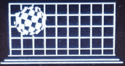

# ESP32 Demos

This project contains [ESP32](https://en.wikipedia.org/wiki/ESP32) demos written for the SSD1306 OLED display.

## Hardware Setup

* ESP32 board: Espressif ESP32 IOT ESP32-DEVKITC 32D ESP32-WROOM-32D
* Monochrome OLED display: AZDelivery AZOLED12864-1000, ean: 7091358562602
* Some cables: AZDelivery Jumper Wire Kabel 20 cm F2M Female to Male
* Micro USB cable for power supply and PC USB serial connection

## Simple Setup

The simplest setup is to use [Visual Studio Code](https://code.visualstudio.com/)
and the [Espressif IDF](https://github.com/espressif/vscode-esp-idf-extension/blob/HEAD/docs/ONBOARDING.md)
extension.

Everything should work pretty much out of the box. Just follow the
installation guidelines, build and flash.

## Manual Setup

* Make sure you have your "esp-idf" sdk setup correctly and have run the
"export.sh" or "export.bat" scripts to setup the environment variables.

### Build

* CMake (and Ninja) is used to build the project.
* Build just the app: `idf.py app`
* Build all: `idf.py all`

### Flash

* Flash binary to device: `idf.py flash`

## Notes on Drivers

* You might need to install USB drivers in case you are working on Windows.

## Used Open Source Software

SSD1306 I2C library for ESP32: https://github.com/imxieyi/esp32-i2c-ssd1306-oled

I used it as a starting point and inspiration, but optimized and extended the library.

THANKS for the great work!
